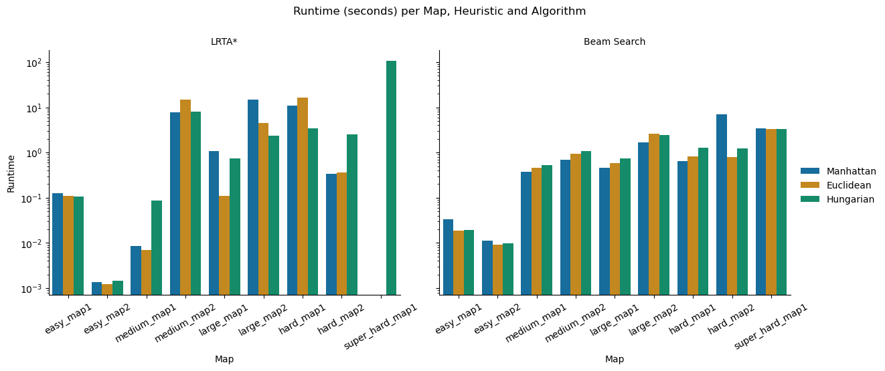
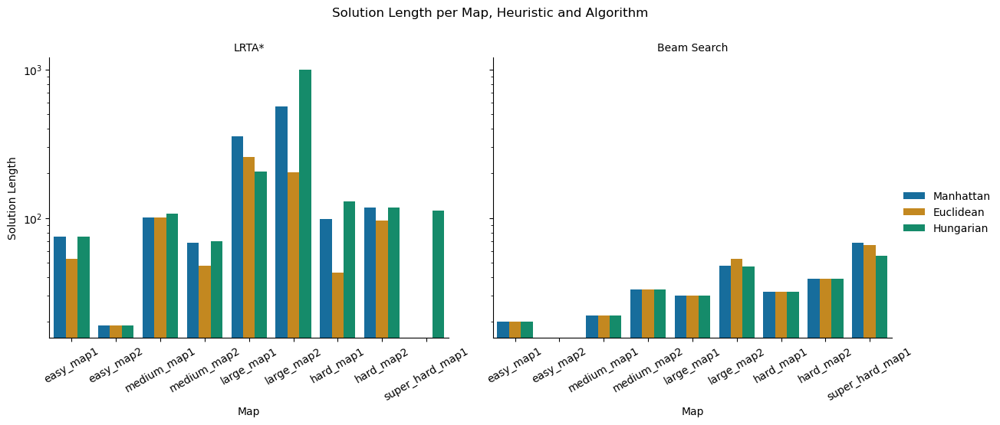
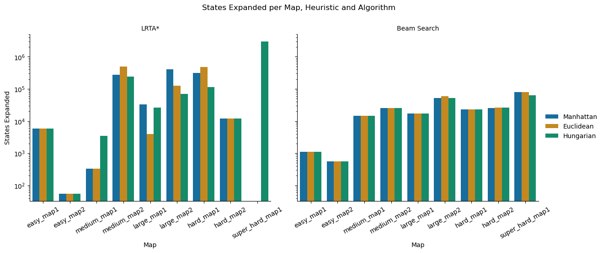

# Proiect 1 Inteligenta Artificiala - Sokoban

#### Dumitrascu Filip-Teodor 333CA

## Continut
1. [Introducere](#introducere)  
2. [Algoritmi](#algoritmi)  
   (optimizari, element cerut la cerinta 3)  
3. [Euristici](#euristici)  
   (jurnalizare, element cerut la cerinta 3)  
4. [Comparatie](#comparatie)  
   (comparatie calitativa si cantitativa, element cerinta 3)

## Introducere
Proiectul presupune rezolvarea jocului Sokoban, joc in care un player trebuie sa
impinga cutii pe anumite pozitii pe o harta cu obstacole. Structura proiectului
consta in:
- `search_methods` - Director unde sunt implementati algoritmii folositi pentru rezolvare
- `sokoban` - Implementarea efectiva a jocului. (cum arata harta, o cutie, playerul, etc)
- `tests` - Hartile generate in format yaml pe care se testeaza implementarea
- `images` - imagini cu rezultate, gifuri cu solutia si grafice
- `main.ipynb` - logica de testare

## Algoritmi
Sunt utilizati 2 algoritmi din categoria problemelor de cautare in spatii de stari:
- `LRTA*`: `search_methods/lrta_star.py`
- `Beam Search`: `search_methods/beam_search.py`

### LRTA*
#### Idee de baza + adaptare la Sokoban
1. Se adaga intr-o tabela cum estimeaza momentan euristica pana la goal state
din starea curenta
2. Daca starea curenta e solutia return
3. Retine cum se poate ajunge la toti succesorii (adica in cadrul succesroului,
din starea anterioara)
4. Se alege cea mai promitatoare miscare (cel mai bun vecin, cost + H[vecin] minim)
5. Se actualizeaza in tabela: euristica starii curente fata de cel mai bun vecin
6. Mutarea pe vecin (next state) si se repeta (tot in limita unui numar de pasi)

#### Optimizari
- Intrucat lrta* se poate bloca intr-o stare din care sa nu isi mai poata updata 
tabela de euristici si nici sa ajuga in goal state, se da restart in starea initiala
dar cu ce a "invatat" pana acum. (adica tabela de euristici nemodificata)

#### Concluzii
- Daca euristica nu il ghideaza bine, algoritmul poate deveni foarte lent. 
- Fara optimizarea precedenta (restart), pe hartile mari: `hard_map1`, `large_map2`,
`super_hard_map1` fara miscari de pull algoritmul nu gaseste solutie (implementate
in schelet dar nu respecta regulile jocului). Cu toate acestea, e posibil sa gaseasca
daca se foloseste o euristica mai complexa decat cele cunoscute. (s-ar putea sa fie
overfitting pe teste, detalii in sectiune urmatoare)

### Beam Search
#### Idee de baza + adaptare la Sokoban
1. Starile in care se poate afla jocul sunt salvate in beam (frontiera acestui algoritm).
Initial doar prima stare (cea cu care incepe jocul) este introdusa.
2. Se parcurg starile din beam. Daca vreuna este cea finala, return
3. Genereaza toate succesoarele din starile beamului
4. Sorteaza succesoarele dupa valoarea ce mai mica a euristicii si se pastreaza
in beam cele mai bune `beam_width` stari.
5. Daca nu se gaseste solutia dupa un numar de pasi, se opreste cautarea si se
returneaza pathul curent.

#### Optimizari
- Se evita ciclarea intre stari prin adaugarea unui set `visited` de stari vizitate
- Se introduce stocasticitatea, modificarea usoara a valorii euristicii pentru a alege
diverse directii de explorare (nu se blocheaza pe un shoulder, minime locale cu aceesi valoare)
- Se reporneste cautarea (in limita pasiilor introdusi) cand nu se mai progreseaza 
(se iese din maxim local)

#### Concluzii
- Latimea beamului este flexibila si aduce consecinte. Un `beam_width` insuficient de
mare rateaza solutia pe teste grele (`hard_map1` - min 100, `large_map2` - min 100,
`super_hard_map1` - min 450)

| | Memorie consumata | Viteza rulare | Gasirea solutiei |
|-|-------------------|---------------|------------------|
| Beam Width Mic | Putina | Foarte rapid | Risca sa rateze solutia |
| Beam Width Mare | Mai multa | Mai lent | Mai sigur (solutie gasita mai des) |

## Euristici
Situate in `search_methods/heuristics.py` reprezinta o estimare a numarului de stari
pentru a ajunge o anumita cutie pe un anumit target. (o euristica consistenta
este si admisibila)

1. Cea mai intuitiva si prima heuristica folosita a fost `heur_displaced`.
Se bazeaza pe numararea a cator cutii sunt pe pozitia goal intr-un anumit state*
(daca returneaza 0, toate sunt la locul lor). **Admisibila? Nu!**
Din moment ce nu verifica in niciun fel pasii mini pentru a ajunge la target, poate
supraestima acest cost. (imposibil pentru o euristica, trebuie sa subestimeze sau sa
reprezinte costul real) ==> nefolosita la compare

2. Urmatoarea euristica folosita a fost `heur_euclidean_distance` suma distantelor
euclidiene de la cutii la cel mai apropiat target. **Consistenta? Da!** dar nu indeajus
de realista pentru jocul sokoban. ==> folosita la compare

3. O euristica mai potrivita bazata pe distante pentru jocul sokoban este
`heur_manhattan_distance`. Intrucat jucatorul se poate muta N E S V ci nu pe diagonala,
distanta manhattan ajuta mai tare: Suma distantelor manhattan (patrate pe orizontata + 
patrate pe verticala) de la cutii la cel mai apropiat target. **Consistenta? Da!**
==> folosita la compare

4. Pentru LRTA* s-a incercat un improvement la aceasta euristica. Rezultatul se gaseste
in `heur_improved` si reprezinta un manhattan in care se tine cont de deadlockuri:
edge-uri care nu duc catre targeturi `edge_deadlock` (si de pe care nu se poate scoate
cutia decat printr-un pull), corner-e `corner_deadlock`(la fel, doar prin pull) si
vecini ale acestor stari de tip deadlock `box_unpushable`. **Adimisibila? Da!**
(se pastreaza de la manhattan). **Consistenta? Nu!** (deadlockurile modifica costul
si nu functioneaza pentru teste mari `large`, `hard`, `super_hard`) ==> nefolosita la compare

5. Pentru imbunatatirea generala a euristicilor, s-a introdus `heur_hungarian`,
bazata pe algoritmul de assignment optim (Hungarian Algorithm). Aceasta euristica
cauta asocierea cutii - target astfel incat suma costurilor sa fie minima globala.
In loc sa ia fiecare cutie la cel mai apropiat target individual (ca la manhattan),
cauta solutia combinata cea mai ieftina. **Consistenta? Da!** (este insa mai costisitoare computațional decat heuristica simpla.) ==> folosita la compare

## Comparatie

