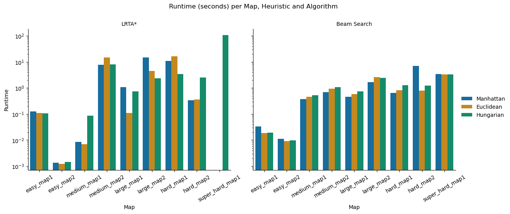

# Project 1 Artificial Intelligence - Sokoban

#### Dumitrascu Filip-Teodor 333CA

## Content
1. [Introduction](#introduction)
2. [Algorithms](#algorithms)
3. [Heuristics](#heuristics)
4. [Comparison](#comparison)

## Introduction
The project involves solving the Sokoban game, in which a player must
push boxes to specific positions on a map with obstacles. The project structure
consists of:
- `search_methods` - Directory where the algorithms used for solving are implemented
- `sokoban` - The actual implementation of the game. (how the map, a box, the player, etc. look)
- `tests` - Maps generated in yaml format on which the implementation is tested
- `images` - images with results, gifs with the solution, and graphs
- `main.ipynb` - testing logic

## Algorithms
Two algorithms from the category of search problems in state spaces are used:
- `LRTA*`: `search_methods/lrta_star.py`
- `Beam Search`: `search_methods/beam_search.py`

### LRTA*
#### Basic idea + adaptation to Sokoban
1. Add to a table how the heuristic currently estimates the goal state
from the current state
2. If the current state is the solution, return
3. Remember how to reach all successors (i.e., within the successor,
from the previous state)
4. Choose the most promising move (best neighbor, minimum cost + H[neighbor])
5. Update the table: heuristic of the current state relative to the best neighbor
6. Move to the neighbor (next state) and repeat (again within a limited number of steps)

#### Optimizations
- Since lrta* can get stuck in a state where it can no longer update 
its heuristic table or reach the goal state, it is restarted in its initial state
but with what it has "learned" so far. (i.e., the unmodified heuristic table)

#### Conclusions
- If the heuristics do not guide it well, the algorithm can become very slow. 
- Without the previous optimization (restart), on large maps: `hard_map1`, `large_map2`,
`super_hard_map1` without pull moves, the algorithm does not find a solution (implemented
in the skeleton but does not follow the rules of the game). However, it is possible to find
if a more complex heuristic than the known ones is used. (There may be
overfitting on tests, details in the next section)

### Beam Search
#### Basic idea + adaptation to Sokoban
1. The states in which the game can be found are saved in the beam (the frontier of this algorithm).
Initially, only the first state (the one with which the game begins) is entered.
2. The states in the beam are traversed. If any of them is the final state, return
3. Generate all successors from the states in the beam
4. Sort the successors by the smallest heuristic value and keep
the best `beam_width` states in the beam.
5. If the solution is not found after a number of steps, stop the search and
return the current path.

#### Optimizations
- Avoid cycling between states by adding a `visited` set of visited states
- Introduce stochasticity, slightly modifying the heuristic value to choose
various exploration directions (does not get stuck on a shoulder, local minima with the same value)
- Restart the search (within the limits of the steps introduced) when no further progress is made 
(exit from the local maximum)

#### Conclusions
- Beam width is flexible and has consequences. An insufficiently large `beam_width`
fails the solution on hard tests (`hard_map1` - min 100, `large_map2` - min 100,
`super_hard_map1` - min 450)

| | Memory consumption | Running speed | Finding the solution |
|-|------------------ -|---------------|------------------|
| Small Beam Width | Low | Very fast | Risk of missing the solution |
| Large Beam Width | Higher | Slower | More reliable (solution found more often) |

## Heuristics
Located in `search_methods/heuristics.py`, these represent an estimate of the number of states
required to reach a specific box on a specific target. (A consistent heuristic
is also acceptable.)

1. The most intuitive and first heuristic used was `heur_displaced`.
It is based on counting how many boxes are in the empty position in a certain state*
(if it returns 0, all are in their place). **Admissible? No!**
Since it does not check the mini steps to reach the target in any way, it may
overestimate this cost. (impossible for a heuristic, it must underestimate or
represent the real cost) ==> not used in comparison

2. The next heuristic used was `heur_euclidean_distance`, the sum of the Euclidean distances
from the boxes to the nearest target. **Consistent? Yes!** but not realistic enough
for the Sokoban game. ==> used in comparison

3. A more suitable distance-based heuristic for the Sokoban game is
`heur_manhattan_distance`. Since the player can move N E S W but not diagonally,
the Manhattan distance is more helpful: the sum of the Manhattan distances (squares horizontally + 
squares vertically) from the boxes to the nearest target. **Consistency? Yes!**
==> used in compare

4. For LRTA*, an improvement to this heuristic was attempted. The result can be found
in `heur_improved` and represents a Manhattan distance that takes deadlocks into account:
edges that do not lead to targets `edge_deadlock` (and from which the box cannot be removed
except by a pull), corners `corner_deadlock` (same, only by pull) and
neighbors of these deadlock states `box_unpushable`. **Admissible? Yes!**
(kept from Manhattan). **Consistent? No!** (deadlocks change the cost
and do not work for large tests `large`, `hard`, `super_hard`) ==> not used in comparison

5. For the general improvement of heuristics, `heur_hungarian` was introduced,
based on the optimal assignment algorithm (Hungarian Algorithm). This heuristic
searches for box-target associations such that the sum of costs is globally minimal.
Instead of taking each box to the nearest individual target (as in Manhattan),
it searches for the cheapest combined solution. **Consistency? Yes!** (However, it is more computationally expensive than the simple heuristic.) ==> used in compare

## Comparison

- LRTA* shows very large runtime spikes (e.g., Hungarian on super_hard_map1), which correlate with the explosion in states expanded. For small/easy maps, runtime is low, but it quickly becomes impractical for complex ones.
- Beam Search has stable runtimes across all maps and heuristics. Even on harder maps, execution remains in a reasonable range compared to LRTA*.

Conclusion: Beam Search is more time-efficient and predictable, while LRTA* is highly unstable and can become very costly on hard instances.

- LRTA* tends to produce longer and highly variable solutions, particularly with Hungarian on larger maps (e.g., large_map2 and super_hard_map1).
- Beam Search consistently finds shorter solutions with small differences between heuristics. Even on harder maps, the solution lengths stay relatively close.

Conclusion: Beam Search achieves more compact solutions, while LRTA* sacrifices solution quality in harder maps.

- LRTA* expands a huge number of states on most maps, especially with more complex ones (e.g., large_map1, hard_map1, super_hard_map1). The Hungarian heuristic sometimes performs better, but it can also blow up (super_hard_map1).
- Beam Search, in contrast, expands far fewer states overall, and the results are much more consistent across maps and heuristics. This indicates that Beam Search is more efficient in terms of search space explored.

Conclusion: Beam Search is significantly more state-efficient, while LRTA* struggles with scalability.
